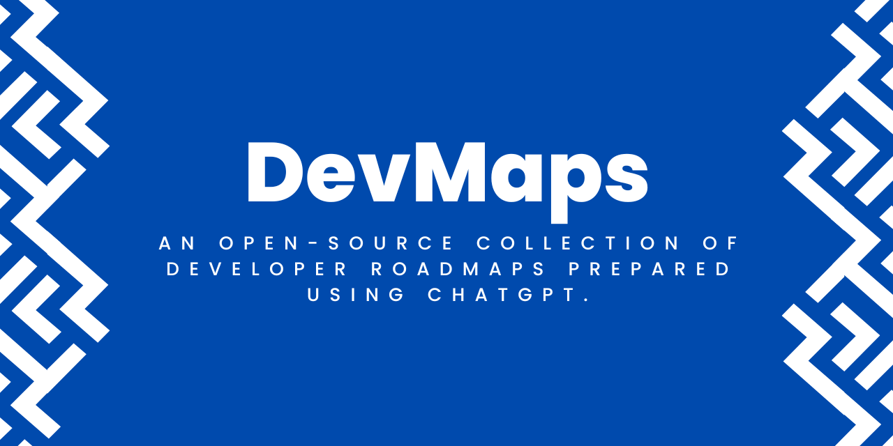

  

  
  

<!-- [START BADGES] -->
<!-- [END BADGES] -->

# Developer Roadmaps

Welcome to the [DevMaps](https://devmaps.netlify.app/)! This is a collection of resources and guides to help developers navigate the often complex and ever-evolving landscape of modern software development.

Whether you're a beginner just starting out or an experienced developer looking to expand your skills, there's something here for everyone. Each roadmap is designed to provide a clear and concise path to mastering a specific technology or skillset, with a focus on practical, hands-on learning.

# Available Roadmaps

Currently, this repository contains roadmaps for the following topics:

 - Front-end Web Development
 - Back-end Web Development
 - Mobile App Development
 - Machine Learning
 - Data Science
 - DevOps
 - and more

Each roadmap includes a list of skills and technologies to learn, along with suggested resources and projects to help you practice and apply what you've learned.

# Share with the community

Please consider sharing a post about [DevMaps](https://devmaps.netlify.app/) and the value it provides. It really does help!

# Contributing

There are many ways to contribute to the DevMaps OpenSource project:

 - Give a GitHub star to the project
 - Create GitHub issues and help us to find bugs and/or request features
 - Contribute to the source code

Please check our [CONTRIBUTING](CONTRIBUTING.md) guidelines.

# Contributors

# Credits

 - Thanks to [Kamran Ahmed](https://github.com/kamranahmedse/developer-roadmap) whose roadmap.sh inspired this project
 - Thanks to [Henk Verlinde](https://github.com/h-enk) for this awesome theme and all the help
 - Thanks to [Bryce Wray](https://github.com/brycewray) for helping me setup this theme

# License

MIT license with exceptions. See the [full license](LICENSE) for details.

Copyright (c) 2023-present, Rajtilak Bhattacharjee

Permission is hereby granted, free of charge, to any person obtaining a copy
of this software and associated documentation files (the "Software"), to deal
in the Software without restriction, including without limitation the rights
to use, copy, modify, merge, publish, distribute, sublicense, and/or sell
copies of the Software, and to permit persons to whom the Software is
furnished to do so, subject to the following conditions:

The above copyright notice and this permission notice shall be included in all
copies or substantial portions of the Software.

THE SOFTWARE IS PROVIDED "AS IS", WITHOUT WARRANTY OF ANY KIND, EXPRESS OR
IMPLIED, INCLUDING BUT NOT LIMITED TO THE WARRANTIES OF MERCHANTABILITY,
FITNESS FOR A PARTICULAR PURPOSE AND NONINFRINGEMENT. IN NO EVENT SHALL THE
AUTHORS OR COPYRIGHT HOLDERS BE LIABLE FOR ANY CLAIM, DAMAGES OR OTHER
LIABILITY, WHETHER IN AN ACTION OF CONTRACT, TORT OR OTHERWISE, ARISING FROM,
OUT OF OR IN CONNECTION WITH THE SOFTWARE OR THE USE OR OTHER DEALINGS IN THE
SOFTWARE.
